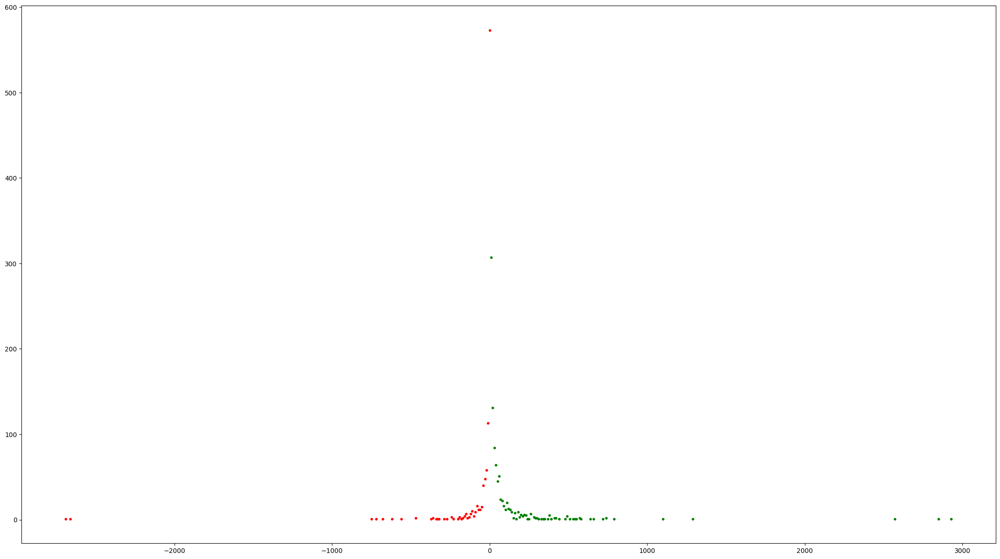

# GitLab Stats

A Sunday afternoon project to pull and graph the number of lines added and removed by your historic GitLab merge requests.

## Example



## Usage

Requires Python 3.8 or later.

```bash
pipenv install
pipenv shell
python download.py [GITLAB_TOKEN] data.txt
python graph.py data.txt graph.png
```

## Hello! 🎉

My name is **Cariad**, and I'm an [independent freelance DevOps engineer](https://cariad.me).

I'd love to spend more time working on projects like this, but--as a freelancer--my income is sporadic and I need to chase gigs that pay the rent.

If this project has value to you, please consider [☕️ sponsoring](https://github.com/sponsors/cariad) me. Sponsorships grant me time to work on _your_ wants rather than _someone else's_.

Thank you! ❤️
